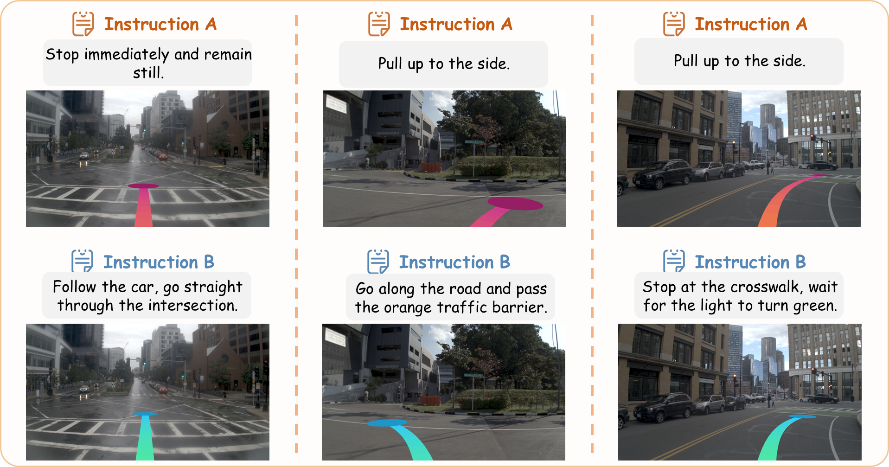
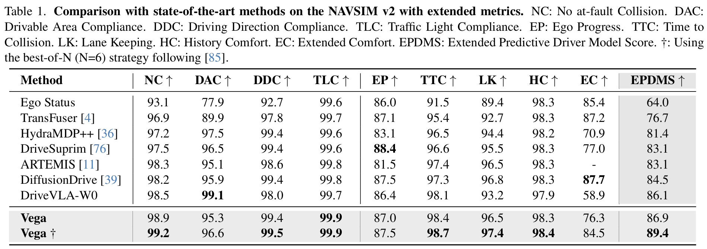
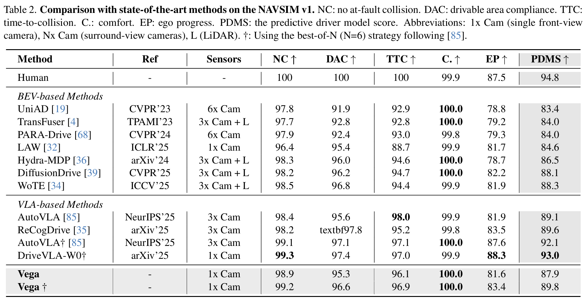

# Vega: Learning to Drive with Natural Language Instructions

<!-- ## 📖 Publications -->
<div align="center">
    <a href="https://arxiv.org/abs/2603.xxxxx"></a>
    <a href='https://zuosc19.github.io/Vega/'></a>
    <!-- <a href='https://huggingface.co/xxx/Vega'></a> -->
    

  >[Sicheng Zuo](https://zuosc19.github.io/)<sup>\*</sup>, Yuxuan Li<sup>\*</sup>, [Wenzhao Zheng](https://wzzheng.net/)<sup>*</sup>$\dagger$, Zheng Zhu, Jie Zhou, [Jiwen Lu](http://ivg.au.tsinghua.edu.cn/Jiwen_Lu/)
  </div>

  <sup>*</sup> Equal contributions. $\dagger$ Project leader.

</div>

**Vega** is a vision-language-world-action model that can follow natural language instructions to generate diverse driving actions and future images. 
Compared to traditional driving models, which can only predict a single expert trajectory or follow 
a limited set of navigation commands, **Vega** can generate multiple planning trajectories and future images 
that follow diverse user instructions. 
In the training stage, **Vega** leverages world modeling to enhance the model's planning capabilities in complex driving scenarios. As a result, our model achieves top performance on both NAVSIM v1 and v2 closed-loop planning benchmarks. 


<p align="center">
  
</p>

## ✨ News
- **[2026/03/26]** Vega: Paper, training and inference code are released. 

## 🚀 TODO
- [ ] Release pretrained model weights.
- [ ] Release instruction annotations (navtrain & navtest).
- [ ] Release instruction generation and data processing scripts.

## 📦 Installation

We tested the code with CUDA 12.1, python3.10 and torch 2.7.1.
```bash
git clone https://github.com/wzzheng/Vega.git
cd Vega

conda create -n vega python=3.10
conda activate vega

pip install -r requirements.txt
# Installl flash-attn from https://github.com/Dao-AILab/flash-attention/releases
```

Replace all the `/path/to` placeholders in the code. For example, replace `/path/to/Vega` with your actual path to Vega workspace. 


## 🤗 Pretrained Models & Datasets
<!-- NOTE Remember to also upload the config files from BAGEL-7B-MoT -->
Our pretrained models will be available on the huggingface hub soon:

<table>
  <thead>
    <tr>
      <th>Version</th>
      <th>Hugging Face Model</th>
      <th>Action Planning</th>
      <th>Image Generation</th>
      <th>#Params</th>
    </tr>
  </thead>
  <tbody>
    <tr>
      <td>Vega</td>
      <td><code>[Coming Soon]</code></td>
      <td>✅</td>
      <td>✅</td>
      <td>14B</td>
    </tr>
  </tbody>
</table>


Our instruction annotations will also be available on the huggingface hub:

<table>
  <thead>
    <tr>
      <th>Version</th>
      <th>Hugging Face Dataset</th>
      <th>Rule-based Instructions</th>
      <th>VLM Instructions</th>
      <th>#Samples</th>
    </tr>
  </thead>
  <tbody>
    <tr>
      <td>navtrain</td>
      <td><code>[Coming Soon]</code></td>
      <td>✅</td>
      <td>✅</td>
      <td>85109</td>
    </tr>
    <tr>
      <td>navtest</td>
      <td><code>[Coming Soon]</code></td>
      <td>✅</td>
      <td>✅</td>
      <td>12146</td>
    </tr>
  </tbody>
</table>

## 🌟 Data preparation

Our dataset is based on [NAVSIM](https://github.com/autonomousvision/navsim/blob/main/docs/install.md). After installing the navsim-devkit and downloading its dataset, download the instruction annotations or run the data processing scripts ([Coming Soon]()).

## 💡 Inference
> **Note:** Inference requires the instruction dataset and model weights, which are currently in the TODO list. The scripts below are provided for code review and reference.

To visualize action planning and future image generation, run [inference_action_image.ipynb](./inference_action_image.ipynb)

You can also run action planning on the whole navtest dataset with [infer.sh](./infer.sh)

```bash
bash infer.sh
```


## 🏋️‍♂️ Training & Finetuning
> **Note:** Training requires the instruction dataset, which is currently in the TODO list. The scripts below are provided for code review and reference.

To train Vega from scratch, download  [ByteDance-Seed/BAGEL-7B-MoT](https://huggingface.co/ByteDance-Seed/BAGEL-7B-MoT). 

To finetune from a pretrained checkpoint, set the `--resume-from` argument to the folder of the safetensors file. 

```bash
bash train.sh
```


## 🧪 Performance

Our model demonstrates competitive performance on both NAVSIM benchmarks. On NAVSIM v2, it scores 86.9 EPDMS 
without any additional performance-enhancing techniques, which is comparable to SOTA. Using the best-of-N 
strategy as prior works, it achieves top performance on NAVSIM v2. These results suggest that <b>Vega</b> 
has learned robust instruction following capabilities and benefited from future image prediction training. 
On NAVSIM v1, our model achieves 87.9 PDMS, matching multi-modal BEV methods, and improves to 89.8 with the 
best-of-N strategy. 

<p align="center">
  
  
</p>


<!-- ## 🌋 visualization -->

## Acknowledgements
Our code is based on the following brilliant repositories:

[Bagel](https://github.com/ByteDance-Seed/Bagel) 
[NAVSIM](https://github.com/autonomousvision/navsim)

Many thanks to these authors!

## Citation

If you find this project helpful, please consider citing the following paper:
```
@article{zuo2026vega,
  title={Vega: Learning to Drive with Natural Language Instructions}, 
  author={Zuo, Sicheng and Li, Yuxuan and Zheng, Wenzhao and Zhu, Zheng and Zhou, Jie and Lu, Jiwen},
  journal={arXiv preprint arXiv:2603.xxxxx},
  year={2026}
}
```